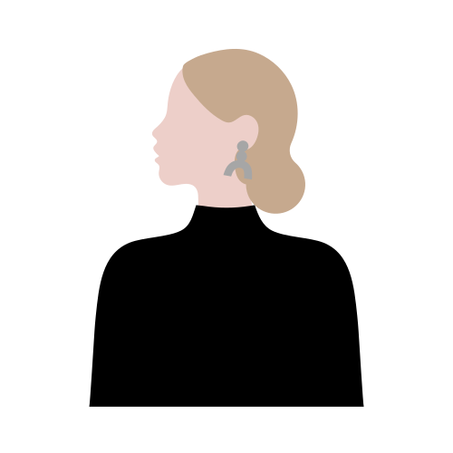

<link rel="preconnect" href="https://fonts.googleapis.com">
<link rel="preconnect" href="https://fonts.gstatic.com" crossorigin>
<link href="https://fonts.googleapis.com/css2?family=Lobster&display=swap" rel="stylesheet">
<link href="https://fonts.googleapis.com/css2?family=Lobster&family=Roboto:ital,wght@0,100;0,300;0,400;0,500;0,700;0,900;1,100;1,300;1,400;1,500;1,700;1,900&display=swap" rel="stylesheet">
<link rel="stylesheet" href="https://kit.fontawesome.com/9f6b8e2cd5.css" crossorigin="anonymous">

<h1 align="center" style="font-family: 'Lobster', sans-serif; font-size: 46px;"><b>Hi , I'm Adrianna!</b></h1>

    

<!--About Me Section-->
<h2 align="center" style="font-family: 'Lobster', sans-serif; font-size: 36px;">About Me</h2>

Hi there! <i class="fa-light fa-hand-wave" style="color: #767676;"></i> I'm the one behind the screen turning caffeine <i class="fa-regular fa-cup-togo" style="color: #767676;"></i> into code <i class="fa-regular fa-code" style="color: #767676;"></i> and visions into interfaces. As a front-end developer with a knack for UX/UI, I delight in crafting experiences that feel like a walk in the park <i class="fa-light fa-bench-tree" style="color: #767676;"></i> — effortless, refreshing, and memorable. I have a soft spot for clean, functional design where simplicity reigns supreme. I'm passionate about the little things that make a big impact on user experience. When I'm not dotting 'i's and crossing 't's in my code, I'm exploring the latest design trends that tickle my creative senses <i class="fa-light fa-paintbrush-pencil" style="color: #767676;"></i>. Join me in celebrating the art of the user-friendly, the beauty of the intuitive, and the joy of designs that just 'click' <i class="fa-regular fa-stars" style="color: #767676;"></i>.
  
<i class="fa-light fa-browser" style="color: #767676;"></i> My portfolio is available <a href="https://adriannaderkacz.com/">here</a>.

 

<!--Skills Section-->
<h1 align="center" style="font-family: 'Lobster', sans-serif; font-size: 36px;">My Skills</h1>

  

    <h4 style="font-family: 'Roboto', sans-serif; font-size: 16px; font-weight: 300;">Frontend Development</h4>
     <!--HTML-->
     <!--CSS-->
     <!--JS-->
     <!--Bootstrap-->
     <!--React-->
     <!--Grid-->
     <!--Flexbox-->
  

  

    <h4 style="font-family: 'Roboto', sans-serif; font-size: 16px; font-weight: 300;">Backend Development</h4>
     <!--Node-->
     <!--APIs-->
  

  

    <h4 style="font-family: 'Roboto', sans-serif; font-size: 16px; font-weight: 300;">Design</h4>
     <!--Figma-->
     <!--UX/UI-->
     <!--Wireframing-->
     <!--Prototyping-->
     <!--User research-->
     <!--Interaction design-->
  

  

    <h4 style="font-family: 'Roboto', sans-serif; font-size: 16px; font-weight: 300;">Other</h4>
     <!--Git-->
     <!--GitHub-->
     <!--GitLab-->
     <!--Markdown-->
     <!--Terminal-->
     <!--VSC-->
  

  
<!--GitHub Stats-->
<h1 align="center" style="font-family: 'Lobster', sans-serif; font-size: 36px;">GitHub Stats</h1>

  
  
  

 

<!---Contact Me-->
<h1 align="center" style="font-family: 'Lobster', sans-serif; font-size: 36px;">Contact Me</h1>

  
  &nbsp;&nbsp;&nbsp;&nbsp;
  
  &nbsp;&nbsp;&nbsp;&nbsp;
  

  

<!--Profile views-->

  

